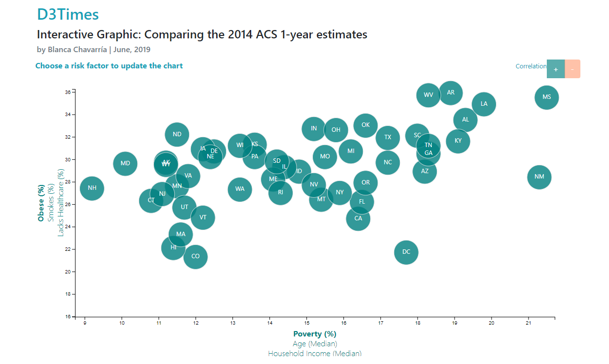
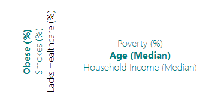
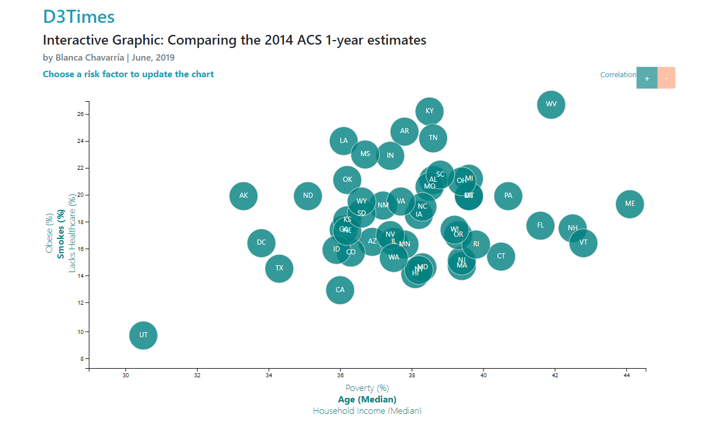
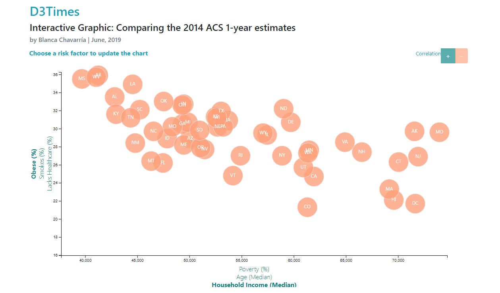
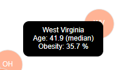
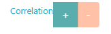
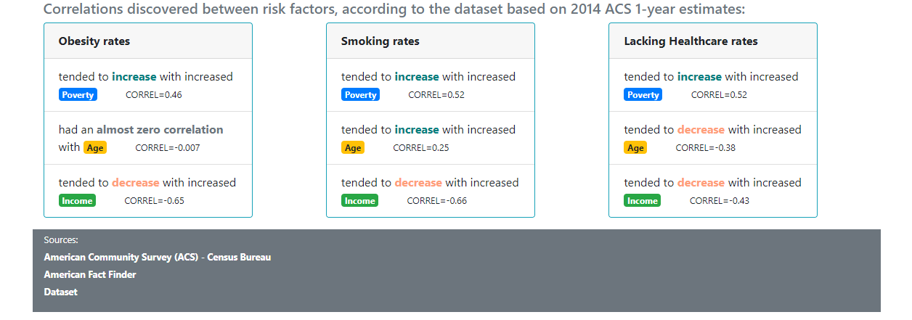
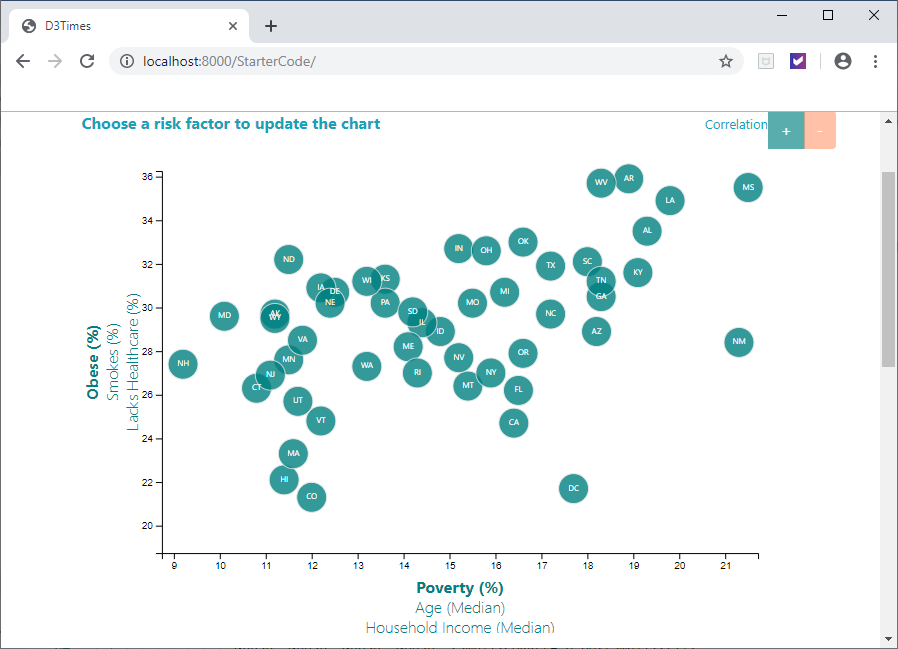
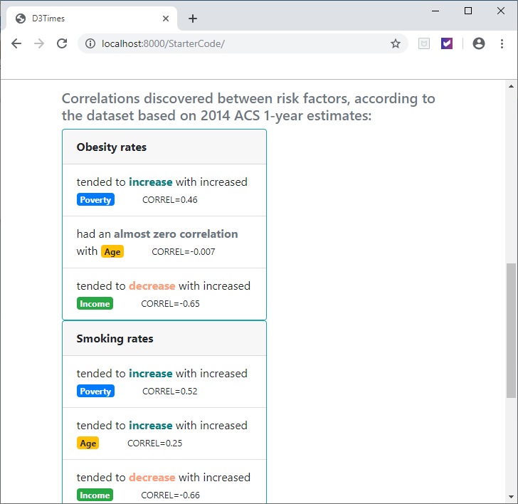

# Data Journalism and D3 Assignment

## Background

A major metro paper wanted to run a series of feature stories about the health risks facing
particular demographic. The first story idea was obtained by sifting through information from
the U.S. Census Bureau and the Behavioral Risk Factor Surveillance System.

An interactive graphic and other informative elements were created to share the current trends
shaping people's lives, and to help readers understand the findings.

The [data set](data/data.csv) used for this assignment is based on 2014 ACS 1-year estimates.

## Level 1: D3 Dabbler

Use D3.js to create a scatter plot between two of the data variables such as `Healthcare vs. 
Poverty` or `Smokers vs. Age`. 

__The scatter plot:__

  - Represents each state with circle elements.
  - Has state abbreviations in the circles.
  - Situates the axes and labels to the left and bottom of the chart.

   

## Level 2: Impress the Boss 

### 1. More Data, More Dynamics

This level includes the plot from Level 1 and:

  - More demographics and risk factors for both axes.

    

  - Additional labels and click events so that the users can decide which data to display.

  - The mouse pointer will change to let the user know which labels are active to make a click 
  on them.

  - Animated transitions for the circles' locations as well as the range of the axes. 
  When the page loads, the circles and their abbreviations begin at the bottom of the graph
  and then take their corresponding position with a delay. When the user selects a risk
  factor, the scales for the axis are recalculated and the circles are repositioned.
  
  - The color in the circles will change if the correlation is positive or negative.

   __Positive correlation__

   

 __Negative correlation__

   

### 2. Incorporate d3-tip

To reveal a specific element's data, when the user hovers their cursor over the element, tooltips were 
added to the circles. 

  

The `d3-tip.js` plugin developed by [Justin Palmer](https://github.com/Caged) was included in the code.

## Bonuses

Additionally, the HTML page includes:

  - An indication of what is the meaning of each color in the circles.
 
   

  - Three Bootstrap Cards that resume the correlations and a small interpretation of the 
  results.

    * The card titles are the variables represented in the y-Axis.
 
    * The Bootstrp badges are the variables represented in the x-Axis.

    * For each combination of x-Axis and y-Axis variables the correlation is provided. 
    The correlation was calculated using the Microsoft Excel function CORREL.

     

  - The scatter plot and the rest of the elements of the page are responsive, usign a 
  function of D3.js and Bootstrap elements, respectively.

    

    

- Links to the sources.

__Note__: You'll need to use `python -m http.server` to run the visualization. This will host 
the page at `localhost:8000` in your web browser.