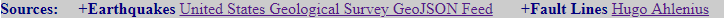

#  Visualizing Data with Leaflet Assignment 

## Background

A tool that will allow the United States Geological Survey (USGS) to visualize their earthquake data and to educate the public and other government organizations on issues facing our planet was built in this assignment.

## Level 1: Basic Visualization

  - The data set selected for this visualization was available in the 
option `All Earthquakes from the Past 7 Days` from [USGS GeoJSON Feed](http://earthquake.usgs.gov/earthquakes/feed/v1.0/geojson.php) page as a GeoJSON file.

  - A map using Leaflet was created. The map shows all of the earthquakes from the data set based on their longitude and latitude.

 

  - The data markers reflect the magnitude of the earthquake in their size and color. Earthquakes with higher magnitudes appear larger and darker in color.

  - Also, the map includes:

    * Popup that provides additional information about the earthquake (Title, Date and Time, Depth in kms) when a marker is clicked. 

 

   * A legend that provides context for the map data.

 

   * The options to zoom in or zoom out.

 

## Level 2: More Data

In this level, a second data set was plotted on the map to illustrate the relationship between tectonic plates and seismic activity. The data set selected is available in this [page](https://github.com/fraxen/tectonicplates/blob/master/GeoJSON/PB2002_boundaries.json) as a GeoJSON file. Also, the file is located in the folder [json](json/PB2002_boundaries.json) in this repository.

Additionaly:

  - Base maps to choose from: Satellite, Grayscale and Outdoors, were included.

 
 

   * __Sattelite__ Shown above

   * __Grayscale__

   

   * __Outdoors__

   

  -  Options to view the two different data sets (Earthquakes and Fault Lines) into overlays, that can be turned on and off independently.

   * __Earthquakes only__

   

   * __Fault Lines only__

    

 - A title for the page was included and links to the sources.

     

__Note__: You'll need to use python -m http.server to run the visualization. This will host the page at localhost:8000 in your web browser.
